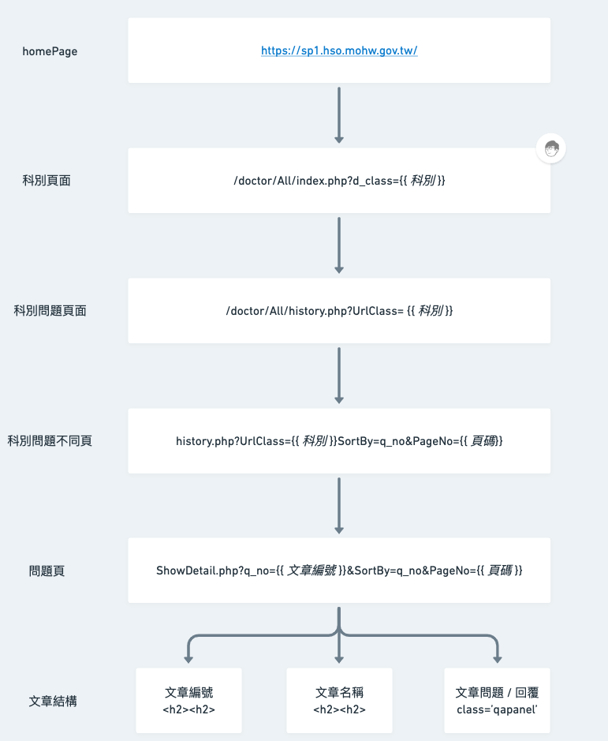

# millions-crawler
This the NCKU course WEB RESOURCE DISCOVERY AND EXPLOITATION homework III, targe is create a crawler application to crawling millions webpage.

[image source](https://www.simplilearn.com/what-is-a-web-crawler-article)

# Homework Scope
1. **Crawl millions of webpages**
2. **Remove non-HTML pages**
3. **Performance optimization**
   - How many page can crawl per hour
   - Total time to crawl millions of pages

# Project architecture

### Spider with [台灣 E 院](https://sp1.hso.mohw.gov.tw/doctor/Index1.php)

# How to use

# Requirement

# Reference
