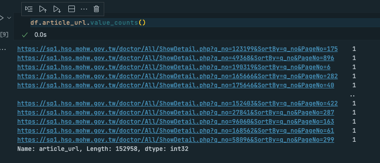
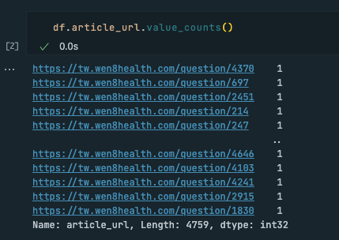
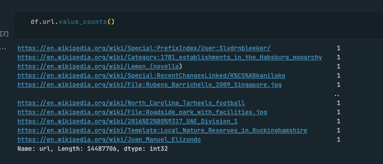

# millions-crawler

This the NCKU course WEB RESOURCE DISCOVERY AND EXPLOITATION homework III, targe is create a crawler application to crawling millions webpage.


[image source](https://www.simplilearn.com/what-is-a-web-crawler-article)

# Homework Scope

1. **Crawl millions of webpages**
2. **Remove non-HTML pages**
3. **Performance optimization**
   - How many page can crawl per hour
   - Total time to crawl millions of pages

# Project architecture

### Spider with [台灣 E 院](https://sp1.hso.mohw.gov.tw/doctor/Index1.php)


### Spider with [問 8 健康諮詢](https://tw.wen8health.com/)


### Spider with [Wiki](https://en.wikipedia.org/wiki/Main_Page)


### Anti-Anti-Spider

1. Skip robot.txt

```bash
# edit settings.py
ROBOTSTXT_OBEY = False
```

2. Use random user-agent

```bash
pip install fake-useragent
```

```python
# edit middlewares.py
class FakeUserAgentMiddleware(UserAgentMiddleware):
    def __init__(self, user_agent=''):
        self.user_agent = user_agent

    def process_request(self, request, spider):
        ua = UserAgent()
        request.headers['User-Agent'] = ua.random
```

```python
DOWNLOADER_MIDDLEWARES = {
   "millions_crawler.middlewares.FakeUserAgentMiddleware": 543,
}
```

# Result

| Spider | Total Page | Total Time (hrs) | Page per Hour |
| :----: | :--------: | :--------------: | :-----------: |
|  tweh  |  152,958   |       1.3        |    117,409    |
|  w8h   |   4,759    |       0.1        |    32,203     |
|  wiki  | 14,487,706 |       24.5       |    592,342    |

### tweh



### w8h



### wiki



# How to use

```bash
cd millions-crawler
scrapy crawl [$spider_name] # $spider_name = tweh, w8h, wiki
```

# Requirement

```bash
pip install -r requirements.txt
```

# Reference

1. [GitHub | fake-useragent](https://github.com/fake-useragent/fake-useragent)
2. [GitHub | scrapy](https://github.com/scrapy/scrapy)
3. [【Day 20】反反爬蟲】](https://ithelp.ithome.com.tw/articles/10224979) 
4. [Documentation of Scrapy](https://docs.scrapy.org/en/latest/index.html)
